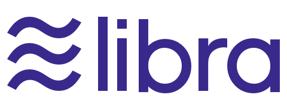

# Awesome-Libra 

Curating the best Libra project, Move project and resource

## Contents

- [Official](#official)
- [Learning resources](#learning-resources)
  - [Websites](#websites)
- [Developers](#developers)
  - [Libraries and Frameworks](#libraries-and-frameworks)
  - [Code examples](#code-examples)
- [Community](#community)
  - [Blogs](#blogs)
- [DApps](#dapps)
  - [Games](#games)
- [Exchanges](#exchanges)
- [Forks](#forks)

## Official

Official resources.

- [Website](https://libra.org/)
- [GitHub](https://github.com/libra)
- [Libra White Paper](https://libra.org/en-US/white-paper/)
- [Move Language White Paper](https://developers.libra.org/docs/assets/papers/libra-move-a-language-with-programmable-resources.pdf)
- [Developer Portal](https://developers.libra.org/docs/welcome-to-libra)

## Learning resources

Libra and Move learning resources.

### Websites

- [Libra Developer Portal](https://developers.libra.org/docs/welcome-to-libra)
- [Rust language Book](https://doc.rust-lang.org/book/title-page.html)
- [Unofficial Block Explorer](https://librabrowser.io/?fbclid=IwAR1LjpGiLWwW3oIFHnM3dm6H47H6D2R0dRAsqjmCcJSNtpW7yCcJu1ud2hE)

## Developers

All about development on Libra platform.

### Libraries and Frameworks
- [gRPC client for Libra in Python](https://github.com/egorsmkv/libra-grpc-py)
- [PyLibra](https://github.com/bandprotocol/pylibra)

### Code examples
- [Move Overview](https://developers.libra.org/docs/move-overview)

## Prototype

### Server Based Wallet Prototype
- [Kulap - Server based Libra Wallet](https://dev.kulap.io/libra/)

## Community
- [Official Webboard](https://community.libra.org/categories)

### Blogs

## DApps

DApp resources.

### DApp directories
### Games

## Exchanges

Libra focused exchanges.

## Forks

Libra forks.
- [POW Libra Classic](https://github.com/miohtama/libra-classic)
- [Zengo - Multi-Signature POC](https://github.com/KZen-networks/libra?fbclid=IwAR06g4UeE6Sv4aAPq-rtZEfycOTRKePkDQEF6k8ie4xiZ872Z19I4vTeNNU)

## License

To the extent possible under law, [Methuz Kaewsai-kao](https://github.com/methuz) has waived all copyright and
related or neighboring rights to this work.

## Contributing

Contributions welcome. Read contributing.md then Add links through pull requests or create an issue to start a discussion.

